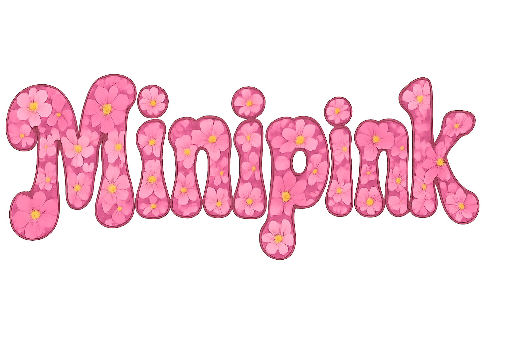

<!DOCTYPE html>
<html lang="en">
<head>
  <meta charset="UTF-8" />
  <meta name="viewport" content="width=device-width, initial-scale=1.0" />
</head>
<body>

  

<h1>🌸 Minishell (aka Minipink)</h1>

<strong>Minishell</strong> is a group project in the 42 School curriculum. The goal is to program a small Unix shell that replicates basic Bash behavior, handling commands, pipes, redirections, and more — all coded from scratch in C.

  <h2>✅ Features</h2>

  <h3>Mandatory Part</h3>
  <ul>
    <li>Custom prompt display</li>
    <li>Command execution using:
      <ul>
        <li>Relative or absolute paths</li>
        <li>PATH environment variable</li>
      </ul>
    </li>
    <li>Environment variable expansion (<code>$VAR</code>, <code>$?</code>)</li>
    <li>Built-in commands:
      <ul>
        <li><code>echo [-n]</code></li>
        <li><code>cd</code></li>
        <li><code>pwd</code></li>
        <li><code>export</code></li>
        <li><code>unset</code></li>
        <li><code>env</code></li>
        <li><code>exit</code></li>
      </ul>
    </li>
    <li>Pipes (<code>|</code>) support</li>
    <li>Redirections:
      <ul>
        <li><code>&lt;</code>, <code>&gt;</code>, <code>&gt;&gt;</code>, <code>&lt;&lt;</code> (heredoc)</li>
      </ul>
    </li>
    <li>Proper signal handling:
      <ul>
        <li><code>Ctrl+C</code>, <code>Ctrl+D</code>, <code>Ctrl+\</code></li>
      </ul>
    </li>
    <li>Quote handling:
      <ul>
        <li><code>'single quotes'</code></li>
        <li><code>"double quotes"</code></li>
      </ul>
    </li>
  </ul>

  <h2>⚙️ Getting started</h2>
  <ol>
    <li>Clone the repository:
      <pre><code>git clone https://github.com/your-username/minishell.git
cd minishell</code></pre>
    </li>
    <li>Compile the project:
      <pre><code>make</code></pre>
    </li>
    <li>Run the shell:
      <pre><code>./minishell</code></pre>
    </li>
  </ol>

  <h2>🧠 Learnings</h2>
  <ul>
    <li>Working efficiently as a team: clear communication, task distribution, and continuous collaboration</li>
    <li>Understanding the internal mechanics of a Unix shell (parsing, execution, redirection, etc.)</li>
    <li>Creating and managing processes using <code>fork</code>, <code>execve</code>, <code>pipe</code>, and <code>wait</code></li>
    <li>Handling Unix signals (<code>SIGINT</code>, <code>SIGQUIT</code>, etc.) and managing terminal input using <code>readline</code></li>
    <li>Debugging and ensuring proper memory management (Valgrind, leaks, malloc/free discipline)</li>
    <li>Writing clean, structured, and norm-compliant C code within a complex project architecture</li>
  </ul>

  <h2>👨‍💻 Authors</h2>
  
This project was made by <strong>JARD Noan <strong> &amp; <strong>AANKOUR Naziha</strong>.

</body>
</html>
